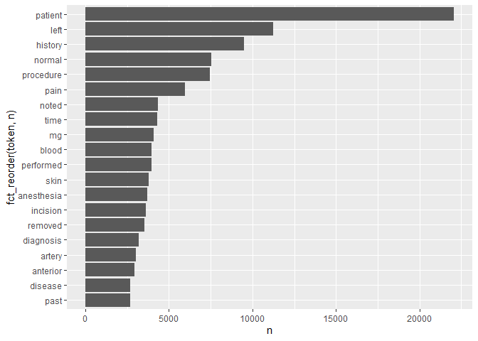

Lab\_6
================
Christina Lin
10/1/2021

``` r
if (!file.exists("mtsamples.csv"))
  download.file(
    url = "https://raw.githubusercontent.com/USCbiostats/data-science-data/master/00_mtsamples/mtsamples.csv",
    destfile = "mtsamples.csv",
    method   = "libcurl",
    timeout  = 60
    )
mtsamples <- read.csv("mtsamples.csv")

library(dplyr)
```

    ## 
    ## Attaching package: 'dplyr'

    ## The following objects are masked from 'package:stats':
    ## 
    ##     filter, lag

    ## The following objects are masked from 'package:base':
    ## 
    ##     intersect, setdiff, setequal, union

``` r
library(ggplot2)
library(tidyverse)
```

    ## -- Attaching packages --------------------------------------- tidyverse 1.3.1 --

    ## v tibble  3.1.4     v purrr   0.3.4
    ## v tidyr   1.1.3     v stringr 1.4.0
    ## v readr   2.0.1     v forcats 0.5.1

    ## -- Conflicts ------------------------------------------ tidyverse_conflicts() --
    ## x dplyr::filter() masks stats::filter()
    ## x dplyr::lag()    masks stats::lag()

``` r
library(tidytext)
```

``` r
mtsamples <- as_tibble(mtsamples)
```

# Question 1: What specialties do we have?

``` r
specialties <- mtsamples %>%
  count(medical_specialty)

specialties %>%
  arrange(desc(n)) %>%
  top_n(15) %>%
  knitr::kable()
```

    ## Selecting by n

| medical\_specialty            |    n |
|:------------------------------|-----:|
| Surgery                       | 1103 |
| Consult - History and Phy.    |  516 |
| Cardiovascular / Pulmonary    |  372 |
| Orthopedic                    |  355 |
| Radiology                     |  273 |
| General Medicine              |  259 |
| Gastroenterology              |  230 |
| Neurology                     |  223 |
| SOAP / Chart / Progress Notes |  166 |
| Obstetrics / Gynecology       |  160 |
| Urology                       |  158 |
| Discharge Summary             |  108 |
| ENT - Otolaryngology          |   98 |
| Neurosurgery                  |   94 |
| Hematology - Oncology         |   90 |

There are 40 specialties. Looking at the distribution:

``` r
ggplot(mtsamples,aes(x = medical_specialty)) +
  geom_histogram(stat = "count") +
  coord_flip()
```

<!-- -->

The specialties are not evenly distributed.

# Question 2: Most frequent words in transcription column

``` r
mtsamples %>%
  unnest_tokens(output = token,input = transcription) %>%
  count(token) %>%
  top_n(20,n) %>%
  ggplot(aes(n, fct_reorder(token,n))) + 
  geom_col()
```

<!-- -->

The word “patient” seems to be important, but we observe a lot of stop
words.

# Question 3: Removing the stop words and numbers

``` r
mtsamples %>%
  unnest_tokens(output = token,input = transcription) %>%
  count(token, sort=TRUE) %>%
  anti_join(stop_words, by = c("token" = "word")) %>%
  filter(!grepl(pattern="^[0-9]+$", x= token)) %>%
  top_n(20,n) %>%
  ggplot(aes(n, fct_reorder(token,n))) + 
  geom_col()
```

<!-- -->

``` r
#using anti_join() after the count is computationally faster
#the filter function is filtering expressions that start and end with a number using regular expression
```

“Patient” is the most common word, followed by “left” and “history”.
This could suggest that there is something wrong with the patient’s left
side of the body. Numbers were part of the highest frequency words, so
they were removed.

# Question 4: Tokenizing with ngrams

First, tokenizing by bi-grams.

``` r
mtsamples %>%
  unnest_ngrams(output = bigram,input = transcription, n = 2) %>%
  count(bigram, sort = TRUE) %>%
  top_n(20)%>%
  ggplot(aes(n, fct_reorder(bigram,n))) + 
  geom_col()
```

    ## Selecting by n

<!-- -->

Using bigrams is not very informative. Thus, trying trigrams:

``` r
mtsamples %>%
  unnest_ngrams(output = trigram,input = transcription, n = 3) %>%
  count(trigram, sort = TRUE) %>%
  top_n(20) %>%
  ggplot(aes(n, fct_reorder(trigram,n))) + 
  geom_col()
```

    ## Selecting by n

<!-- -->

Using trigrams, it appears that there are a lot of phrases that
associate with surgery and operations.

# Question 5: Words that appear before and after “left”

``` r
bigrams <- mtsamples %>%
  unnest_ngrams(ngram,transcription,n=2) %>%
  separate(ngram, into = c("word1","word2", sep = " "))

#Words appearing after "left"
bigrams %>%
  select(word1, word2) %>%
  filter(word1 == "left") %>%
  count(word2, sort = TRUE)%>%
  top_n(20) %>%
  knitr::kable(caption = "Words AFTER 'left'")
```

    ## Selecting by n

| word2       |   n |
|:------------|----:|
| side        | 543 |
| lower       | 418 |
| upper       | 366 |
| ventricular | 360 |
| anterior    | 308 |
| knee        | 276 |
| foot        | 246 |
| main        | 244 |
| sided       | 211 |
| breast      | 201 |
| lateral     | 179 |
| shoulder    | 178 |
| ventricle   | 162 |
| the         | 150 |
| and         | 148 |
| circumflex  | 145 |
| arm         | 144 |
| eye         | 141 |
| hip         | 141 |
| leg         | 138 |

Words AFTER ‘left’

``` r
#Words appearing before "left"
bigrams %>%
  select(word1, word2) %>%
  filter(word2 == "left") %>%
  count(word1, sort = TRUE) %>%
  top_n(20) %>%
  knitr::kable()
```

    ## Selecting by n

| word1     |    n |
|:----------|-----:|
| the       | 4860 |
| and       |  617 |
| a         |  344 |
| of        |  290 |
| her       |  246 |
| his       |  220 |
| diagnosis |  204 |
| 1         |  197 |
| with      |  171 |
| was       |  145 |
| 2         |  132 |
| normal    |  120 |
| 3         |   94 |
| than      |   70 |
| to        |   69 |
| first     |   56 |
| procedure |   53 |
| in        |   51 |
| 5         |   42 |
| mild      |   41 |

Since we are looking at single words again, it is good idea to treat
these as single tokens. Therefore, remove stop words and numbers from
word1. Words appearing after ‘left’ do not seem to have this problem.

``` r
bigrams %>%
  filter(word2 == "left") %>%
  filter(!(word1 %in% stop_words$word) & (!grepl(pattern="^[0-9]+$", word1))) %>%
  count(word1, sort= TRUE) %>%
  top_n(20) %>%
  knitr::kable(caption = "Words BEFORE 'left'")
```

    ## Selecting by n

| word1     |   n |
|:----------|----:|
| diagnosis | 204 |
| normal    | 120 |
| procedure |  53 |
| mild      |  41 |
| performed |  39 |
| artery    |  36 |
| distal    |  32 |
| patient   |  29 |
| mid       |  28 |
| lesion    |  27 |
| diagnoses |  26 |
| mass      |  26 |
| post      |  26 |
| severe    |  25 |
| cm        |  24 |
| complaint |  22 |
| lower     |  22 |
| entire    |  19 |
| judkins   |  18 |
| preserved |  18 |

Words BEFORE ‘left’

# Question 6: Which words used the most in each specialty?

``` r
mtsamples %>%
  group_by(medical_specialty) %>%
  unnest_tokens(output = token,input = transcription) %>%
  filter(!(token %in% stop_words$word) & (!grepl(pattern="^[0-9]+$", token))) %>%
  count(token, sort = TRUE) %>%
  top_n(5) %>%
  arrange(medical_specialty, n) %>%
  knitr::kable()
```

    ## Selecting by n

| medical\_specialty            | token        |    n |
|:------------------------------|:-------------|-----:|
| Allergy / Immunology          | nasal        |   13 |
| Allergy / Immunology          | past         |   13 |
| Allergy / Immunology          | allergies    |   21 |
| Allergy / Immunology          | patient      |   22 |
| Allergy / Immunology          | noted        |   23 |
| Allergy / Immunology          | history      |   38 |
| Autopsy                       | body         |   40 |
| Autopsy                       | anterior     |   47 |
| Autopsy                       | neck         |   55 |
| Autopsy                       | inch         |   59 |
| Autopsy                       | left         |   83 |
| Bariatrics                    | gastric      |   30 |
| Bariatrics                    | surgery      |   34 |
| Bariatrics                    | weight       |   36 |
| Bariatrics                    | history      |   50 |
| Bariatrics                    | patient      |   62 |
| Cardiovascular / Pulmonary    | history      |  654 |
| Cardiovascular / Pulmonary    | coronary     |  681 |
| Cardiovascular / Pulmonary    | artery       | 1085 |
| Cardiovascular / Pulmonary    | patient      | 1516 |
| Cardiovascular / Pulmonary    | left         | 1550 |
| Chiropractic                  | left         |   54 |
| Chiropractic                  | history      |   56 |
| Chiropractic                  | dr           |   66 |
| Chiropractic                  | patient      |   85 |
| Chiropractic                  | pain         |  187 |
| Consult - History and Phy.    | mg           |  908 |
| Consult - History and Phy.    | pain         | 1153 |
| Consult - History and Phy.    | normal       | 1368 |
| Consult - History and Phy.    | history      | 2820 |
| Consult - History and Phy.    | patient      | 3046 |
| Cosmetic / Plastic Surgery    | incision     |   67 |
| Cosmetic / Plastic Surgery    | skin         |   88 |
| Cosmetic / Plastic Surgery    | breast       |   95 |
| Cosmetic / Plastic Surgery    | procedure    |   98 |
| Cosmetic / Plastic Surgery    | patient      |  116 |
| Dentistry                     | procedure    |   82 |
| Dentistry                     | left         |   94 |
| Dentistry                     | teeth        |  104 |
| Dentistry                     | tooth        |  108 |
| Dentistry                     | patient      |  195 |
| Dermatology                   | procedure    |   44 |
| Dermatology                   | left         |   58 |
| Dermatology                   | cm           |   77 |
| Dermatology                   | patient      |  101 |
| Dermatology                   | skin         |  101 |
| Diets and Nutritions          | food         |   27 |
| Diets and Nutritions          | plan         |   27 |
| Diets and Nutritions          | day          |   28 |
| Diets and Nutritions          | carbohydrate |   37 |
| Diets and Nutritions          | weight       |   40 |
| Diets and Nutritions          | patient      |   43 |
| Discharge Summary             | hospital     |  183 |
| Discharge Summary             | history      |  208 |
| Discharge Summary             | mg           |  301 |
| Discharge Summary             | discharge    |  358 |
| Discharge Summary             | patient      |  672 |
| Emergency Room Reports        | denies       |  149 |
| Emergency Room Reports        | normal       |  255 |
| Emergency Room Reports        | pain         |  273 |
| Emergency Room Reports        | history      |  356 |
| Emergency Room Reports        | patient      |  685 |
| Endocrinology                 | dissection   |   45 |
| Endocrinology                 | gland        |   45 |
| Endocrinology                 | nerve        |   45 |
| Endocrinology                 | history      |   57 |
| Endocrinology                 | left         |   63 |
| Endocrinology                 | patient      |  121 |
| Endocrinology                 | thyroid      |  129 |
| ENT - Otolaryngology          | procedure    |  181 |
| ENT - Otolaryngology          | ear          |  182 |
| ENT - Otolaryngology          | left         |  219 |
| ENT - Otolaryngology          | nasal        |  281 |
| ENT - Otolaryngology          | patient      |  415 |
| Gastroenterology              | colon        |  240 |
| Gastroenterology              | normal       |  328 |
| Gastroenterology              | history      |  341 |
| Gastroenterology              | procedure    |  470 |
| Gastroenterology              | patient      |  872 |
| General Medicine              | mg           |  503 |
| General Medicine              | pain         |  567 |
| General Medicine              | normal       |  717 |
| General Medicine              | history      | 1027 |
| General Medicine              | patient      | 1356 |
| Hematology - Oncology         | mass         |   97 |
| Hematology - Oncology         | mg           |  107 |
| Hematology - Oncology         | left         |  187 |
| Hematology - Oncology         | history      |  290 |
| Hematology - Oncology         | patient      |  316 |
| Hospice - Palliative Care     | family       |   19 |
| Hospice - Palliative Care     | pain         |   19 |
| Hospice - Palliative Care     | daughter     |   22 |
| Hospice - Palliative Care     | history      |   27 |
| Hospice - Palliative Care     | mg           |   28 |
| Hospice - Palliative Care     | patient      |   43 |
| IME-QME-Work Comp etc.        | left         |   70 |
| IME-QME-Work Comp etc.        | injury       |   81 |
| IME-QME-Work Comp etc.        | dr           |   82 |
| IME-QME-Work Comp etc.        | patient      |  106 |
| IME-QME-Work Comp etc.        | pain         |  152 |
| Lab Medicine - Pathology      | upper        |   20 |
| Lab Medicine - Pathology      | lobe         |   29 |
| Lab Medicine - Pathology      | lymph        |   30 |
| Lab Medicine - Pathology      | cm           |   35 |
| Lab Medicine - Pathology      | tumor        |   35 |
| Letters                       | dr           |   46 |
| Letters                       | normal       |   53 |
| Letters                       | patient      |   65 |
| Letters                       | abc          |   71 |
| Letters                       | pain         |   80 |
| Nephrology                    | left         |  132 |
| Nephrology                    | kidney       |  144 |
| Nephrology                    | history      |  160 |
| Nephrology                    | renal        |  257 |
| Nephrology                    | patient      |  348 |
| Neurology                     | time         |  278 |
| Neurology                     | history      |  429 |
| Neurology                     | normal       |  485 |
| Neurology                     | patient      |  648 |
| Neurology                     | left         |  672 |
| Neurosurgery                  | left         |  222 |
| Neurosurgery                  | procedure    |  247 |
| Neurosurgery                  | c6           |  266 |
| Neurosurgery                  | c5           |  289 |
| Neurosurgery                  | patient      |  374 |
| Obstetrics / Gynecology       | normal       |  276 |
| Obstetrics / Gynecology       | incision     |  293 |
| Obstetrics / Gynecology       | procedure    |  301 |
| Obstetrics / Gynecology       | uterus       |  317 |
| Obstetrics / Gynecology       | patient      |  628 |
| Office Notes                  | noted        |   60 |
| Office Notes                  | history      |   76 |
| Office Notes                  | patient      |   94 |
| Office Notes                  | negative     |  193 |
| Office Notes                  | normal       |  230 |
| Ophthalmology                 | chamber      |  149 |
| Ophthalmology                 | anterior     |  150 |
| Ophthalmology                 | procedure    |  176 |
| Ophthalmology                 | patient      |  258 |
| Ophthalmology                 | eye          |  456 |
| Orthopedic                    | lateral      |  472 |
| Orthopedic                    | procedure    |  669 |
| Orthopedic                    | pain         |  763 |
| Orthopedic                    | left         |  998 |
| Orthopedic                    | patient      | 1711 |
| Pain Management               | injected     |   76 |
| Pain Management               | pain         |   76 |
| Pain Management               | needle       |  156 |
| Pain Management               | procedure    |  197 |
| Pain Management               | patient      |  236 |
| Pediatrics - Neonatal         | child        |   82 |
| Pediatrics - Neonatal         | mom          |   82 |
| Pediatrics - Neonatal         | normal       |  155 |
| Pediatrics - Neonatal         | history      |  235 |
| Pediatrics - Neonatal         | patient      |  247 |
| Physical Medicine - Rehab     | history      |   54 |
| Physical Medicine - Rehab     | motor        |   62 |
| Physical Medicine - Rehab     | pain         |   95 |
| Physical Medicine - Rehab     | left         |  104 |
| Physical Medicine - Rehab     | patient      |  220 |
| Podiatry                      | incision     |   96 |
| Podiatry                      | tendon       |   98 |
| Podiatry                      | left         |  137 |
| Podiatry                      | patient      |  231 |
| Podiatry                      | foot         |  232 |
| Psychiatry / Psychology       | reported     |  141 |
| Psychiatry / Psychology       | mother       |  164 |
| Psychiatry / Psychology       | mg           |  183 |
| Psychiatry / Psychology       | history      |  344 |
| Psychiatry / Psychology       | patient      |  532 |
| Radiology                     | mild         |  242 |
| Radiology                     | exam         |  302 |
| Radiology                     | patient      |  304 |
| Radiology                     | normal       |  644 |
| Radiology                     | left         |  701 |
| Rheumatology                  | day          |   22 |
| Rheumatology                  | examination  |   22 |
| Rheumatology                  | joints       |   22 |
| Rheumatology                  | pain         |   23 |
| Rheumatology                  | mg           |   26 |
| Rheumatology                  | patient      |   34 |
| Rheumatology                  | history      |   50 |
| Sleep Medicine                | stage        |   29 |
| Sleep Medicine                | activity     |   31 |
| Sleep Medicine                | apnea        |   35 |
| Sleep Medicine                | patient      |   69 |
| Sleep Medicine                | sleep        |  143 |
| SOAP / Chart / Progress Notes | blood        |  194 |
| SOAP / Chart / Progress Notes | pain         |  239 |
| SOAP / Chart / Progress Notes | history      |  254 |
| SOAP / Chart / Progress Notes | mg           |  302 |
| SOAP / Chart / Progress Notes | patient      |  537 |
| Speech - Language             | evaluation   |   17 |
| Speech - Language             | goals        |   17 |
| Speech - Language             | term         |   17 |
| Speech - Language             | time         |   17 |
| Speech - Language             | patient’s    |   28 |
| Speech - Language             | speech       |   35 |
| Speech - Language             | therapy      |   41 |
| Speech - Language             | patient      |  105 |
| Surgery                       | incision     | 1641 |
| Surgery                       | anesthesia   | 1687 |
| Surgery                       | procedure    | 3243 |
| Surgery                       | left         | 3263 |
| Surgery                       | patient      | 4855 |
| Urology                       | history      |  196 |
| Urology                       | left         |  288 |
| Urology                       | procedure    |  306 |
| Urology                       | bladder      |  357 |
| Urology                       | patient      |  776 |
